# What Is This Project?

## Document Assistant (Chat With Your Docs)

Ask questions about a collection of documents and get an answer that cites the exact passage it
came from. When the documents do not contain the answer, the system says so instead of guessing.

Built as a take-home for Newpage Solutions (Option 1, Chat With Your Docs). The demo corpus is
eight FDA guidance documents split across two departments, because that audience is the one this
design is aimed at: in a regulated industry, a confident wrong answer costs more than no answer at
all.

Each of those eight is a **three page excerpt** rather than the complete guidance. This is done to
reduce the cold-start up time when we run `docker compose up`. At the moment, it would take a little
less than 4 minutes to completely boot up the application from the docker container.


Design notes live in [`specs.md`](specs.md). Every decision below has a numbered record in
[`docs/adr/`](docs/adr/) with the options that were considered and the reason the losing ones lost.

Please find relevant screenshots for this project at the end of this file.

---

## 1. Quick setup (How To Run This Application)

You need Docker, and a Gemini API key. The key is free and takes about two minutes to create at
https://aistudio.google.com/apikey. No key is committed to this repo, and none is needed to read
the code.

You do **not** need to install Ollama. Embeddings run in a container that Compose starts and
populates for you, so `docker compose up` is self-contained. Ollama on your own machine is needed
only if you want to switch generation to the local model, which is optional and covered below.

```bash
git clone https://github.com/iprowriter/newpage.git
cd newpage
cp .env.example .env.local
# open .env.local and paste your key into GEMINI_API_KEY
docker compose up
```

That is the whole setup. Compose starts seven services, runs the database migration, waits for the
app to be serving, then ingests the demo corpus for you.

Give it time on the first run, and expect these rough numbers, measured on an Apple silicon laptop
from completely empty volumes:

| Stage | Time |
|---|---|
| Images build, services healthy, app answering on :3000 | about 2 minutes |
| Embedding model pulled (274 MB, gates everything else) | 16 seconds |
| Demo corpus fully indexed, 8 PDFs and 78 chunks | about 100 seconds |

**The app is usable long before the corpus finishes.** Seeding deliberately runs after the app is
serving, so you can open it, watch documents move through `pending`, `processing` and `ready`, and
start asking questions of the collections that have finished. The reason for this is simple: A silent 
five minute wait before anything rendered would be a worse first impression than watching it fill.

Indexing runs on CPU inside the container, which is the trade that lets `docker compose up` work
with nothing installed on your machine. Subsequent starts reuse the volumes and are quick.

When it settles, open:

| What | Where |
|---|---|
| The app | http://localhost:3000 |
| Trace viewer (built in) | http://localhost:3000/traces |
| Jaeger (OpenTelemetry) | http://localhost:16686 |

Every published port is high on purpose (Postgres on 55432, Qdrant on 56333, the embedding model on
11435) so that starting this project cannot collide with a Postgres, Qdrant or Ollama you already
run. All of them are bound to 127.0.0.1, so nothing is exposed to your network.

### Running it without Docker

If you prefer to run the app directly, the data services still come from Compose:

```bash
docker compose up postgres qdrant ollama jaeger
npm install
npm run db:migrate
npm run seed          # ingests the demo corpus
npm run dev
```

Uncomment `EMBEDDING_BASE_URL=http://localhost:11435` in `.env.local` first. Compose publishes the
embedding container on 11435, and that line is what points the host-side app at it. Without it the
app falls back to looking for Ollama on your own machine at 11434, and ingestion fails on a machine
that does not have it. Port 11435 rather than 11434 so it cannot collide with a host Ollama you may
already be running.

### Running the model locally instead of Gemini

The app ships with a second provider. If you have [Ollama](https://ollama.com) on your machine:

```bash
ollama pull llama3.2:3b
# then flip the provider toggle at the bottom of the sidebar, or set LLM_PROVIDER=ollama
```
It is important to mention that using ollama for retrieval and generation does not perform as
good as using hosted inference such as Gemini. I decided to add it anyway to fulfill the 
privacy concerns some users may have while using this app. If you never want your document
to end up on Gemini server or any third-party server, then please use the Ollama. The trade-off 
is speed and quality of the answers. 

### Useful commands

```bash
npm test                            48 tests, no network, about one second
npm run typecheck                   tsc, plus Next route type generation
npm run lint                        includes the import rule described in section 4
npm run eval                        the full quality harness
npm run eval -- --retrieval-only    the deterministic half: seconds, and free
npm run eval -- --provider ollama   the local column of the comparison
npm run calibrate                   sets the refusal threshold from measured data
npm run calibrate:attribution       sets the attribution thresholds from measured data
```

---

## 2. What This App Does

**Collections.** You create a named collection (Clinical Operations, Manufacturing Quality) and
upload documents into it. Questions are answered only from the collection you are asking. This is
the data isolation story: 'Marketing' can never see what 'Legal' uploaded.

**Chats.** If you just want to ask about one file, you upload it without naming anything first. A
chat is created behind the scenes on that first upload, not on the click that got you there, so
you never leave empty rows behind. A chat can later be promoted into a full collection.

**Answers that cite their source.** Every answer lists the passages it used. Click one and you see
the exact text, its page, and its heading path in the original document, along with the retrieval
score. Scores are shown rather than hidden, because a citation you cannot inspect is a claim
rather than evidence.

**Highlight any sentence to trace it.** Select part of an answer and press "Where is this from?".
The supporting passage opens with the matching sentence marked. If no single passage supports what
you highlighted, it says that instead of pointing at a best guess. Section 6 is honest about how
well this works.

**Refusal  

**Failures look different from refusals.** Provider problems (rate limits, a rejected key, a
retired model, a network fault) are typed, retried with backoff where retrying could help, and
shown with the action that fits. When the hosted model is overloaded, the failure message offers
to run the question locally.

**Help getting started.** After the first upload, the collection can summarise itself, and offers
three starter questions generated from the actual documents. Each answer suggests two follow up
questions, which come back in the same model call as the answer rather than costing a second one.
The summary is generated only when asked for, but it is kept once it exists: it comes back with the
collection and stays above the thread, collapsed, with a "Summarise again" button. 

**Your thread is still there when you come back.** Questions and answers for a collection are kept,
so switching to another collection and returning does not wipe what you have already asked.
Restored answers keep their sources, their scores and any rating you gave them. If a document has
been deleted since, the citation says so rather than quietly disappearing. 

**Feedback on answers.** A thumbs up or down under each answer lands on the stored trace, next to
the passages and scores that produced it, so a bad answer can be investigated rather than just
counted. The rating comes back with the answer when history is restored.

**Full observability.** Every query is stored and viewable at `/traces`: the question, the filter
that was applied, every retrieved chunk with its score, the grading decision, whether the retry
fired, latency for each stage, token counts and the exact model id. The same information is
emitted as OpenTelemetry spans to Jaeger, which ships in the Compose file. 
While on localhost, find the observability here: (http://localhost:3000/traces)

**Light and dark themes**, an explicit toggle rather than a guess based on your operating system.

---

## 3. Architecture

```
┌──────────────────────────────────────────────────────┐
│  web  (Next.js, TypeScript)                          │
│                                                      │
│   src/app/        UI: collections, chat, traces      │
│   src/app/api/    thin route handlers                │
│   src/lib/rag/    retrieval core, no next imports    │
│   scripts/        headless entry points              │
└───────────────┬──────────────────────┬───────────────┘
                │                      │
        ┌───────▼──────┐       ┌───────▼───────┐      ┌──────────────┐
        │  postgres    │       │    qdrant     │      │  Gemini API  │
        │              │       │               │      │      or      │
        │ collections  │       │ one vector    │      │ Ollama       │
        │ documents    │       │ collection,   │      └──────────────┘
        │ chunks       │       │ filtered by   │
        │ query_traces │       │ collection_id │
        │ eval_runs    │       │               │
        └──────────────┘       └───────────────┘
```

Seven Compose services: `postgres`, `qdrant`, `ollama` (embeddings only), `jaeger`, `migrate`
(runs once and gates the app), `web`, and `seed` (runs after the app is serving).

Two stores, on purpose. Postgres holds the chunk text and all the metadata; Qdrant holds the
vector and a small payload. Keeping the text in Postgres means a citation can be rendered without
a round trip to the vector database, and it means the trace viewer can show you a passage long
after the query ran.

**The one structural rule: nothing under `src/lib/rag/` may import from `next`.** An ESLint rule
enforces it. That single constraint is what lets the whole pipeline run headless from a script,
which is what makes the eval harness and the calibration scripts possible at all. If the retrieval
core could reach for a framework type, testing it would need a server, and a harness that needs a
server does not get run.

### The query path

```
        ┌──────────┐
        │ retrieve │◄─────────────┐
        └────┬─────┘              │
             ▼                    │ once only
        ┌──────────┐   weak   ┌───┴─────┐
        │  grade   ├─────────►│ rewrite │
        └────┬─────┘          └─────────┘
             │ ok                  │ still weak
             ▼                     ▼
        ┌──────────┐          ┌─────────┐
        │ generate │          │ refuse  │
        └──────────┘          └─────────┘
```

Retrieve, then grade what came back. If it is weak, rewrite the question and try once. If it is
still weak, refuse and explain why. The retry is hard bounded at one, and there is a test that
proves it, because an unbounded retry loop against a paid API is the obvious way to lose money in
your sleep.

---

## 4. RAG and LLM approach

### Chunking

Chunks follow the structure of the document rather than a fixed character count. Text is extracted
into headings, paragraphs and list items, then packed up to a token budget without crossing a
heading boundary, with one or two sentences of overlap where a section continues. A chunk that
straddles two topics produces retrieval that looks like a bad model, and the cause is very hard to
see from the answer.

Every chunk is stored twice, in two forms. The **embedded** text carries the heading breadcrumb
("Guidance for Industry > Modifications and Corrections > ...") in front of the body. The
**displayed** text does not. A chunk embedded on its own has lost the context that made it
mean something, and the breadcrumb restores most of it for the price of a few tokens. The
displayed text has to slice back out of the source exactly, so citations highlight against the
real document rather than a rebuilt approximation. These two fields differing is subtle and easy
to break, so there is a test that asserts it directly.

Considered and rejected: fixed size chunks with overlap (simple, but splits mid sentence and mid
section), and semantic chunking by embedding distance (interesting, but it costs an embedding pass
over everything to make a decision the document structure already tells you for free). See
ADR-0012.

### Embedding model

`nomic-embed-text`, run locally through Ollama, always, no hosted option.

Two reasons. The first is that it is the honest answer to a life sciences client who cannot send
documents to a third party API: embeddings are the step that touches every word of every document,
so keeping that local is the part that actually matters. The second is cost and reproducibility,
since embedding a corpus repeatedly while tuning chunk sizes should not have a bill attached.

Note that changing this model means dropping the vector collection and reindexing, because the
vector dimension is fixed when the collection is created. That is a real operational cost and it
is why the model id is pinned. See ADR-0004.

### Vector database

**Qdrant.** I started with ChromaDB and changed my mind, which is recorded in ADR-0008 and
ADR-0010 rather than quietly edited out.

Chroma is the fastest thing to get running, and for a demo that is a real argument. Qdrant won on
three things that matter beyond the demo: payload filtering is a first class feature (which is how
collection isolation is implemented), it has native sparse vectors and a fusion API (so hybrid
search later is configuration rather than writing BM25 by hand), and it is a single Docker image
with no Python in the application.

Isolation is one Qdrant collection with a filter on `collection_id`, not a separate collection per
department. A filter is cheap and it scales to many collections. It also fails silently if you
forget it, which shaped the guardrail described below.

### Language model

**Gemini by default, `gemini-3.6-flash`, pinned.** It has a free tier good enough to run the whole
eval harness, it is fast, and it supports structured output, which is how the answer and its follow 
up questions come back in a single call.

**Ollama with `llama3.2:3b` as a second provider**, selectable at runtime from the sidebar. Both
sit behind one small interface, which also happens to be the seam the tests mock, so the entire
test suite runs with no network.

Model ids are pinned everywhere, never a floating alias like `-latest`. An eval number that cannot
be traced to an exact model is not a measurement, it is a rumour. See ADR-0014.

### Orchestration

**LangGraph, for control flow only.** The graph gives a readable, testable state machine for the
retrieve, grade, rewrite, refuse and generate path, and the branches are the guardrail.

Nothing else from LangChain is used. Qdrant, the embedding calls and the prompts are all called
directly. Retrieval abstractions hide exactly the thing being assessed here, and when retrieval
misbehaves you want to read your own code, not a framework's. See ADR-0013.

### Prompts and context management

The prompt is small and strict: answer only from the passages provided, cite them, and if they do
not contain the answer, say so. Retrieved passages are assembled in rank order with their
breadcrumb and page, up to the top k configured per collection.

The follow up questions come back as structured output in the same generation call as the answer.
Asking twice would double the latency and the cost for something the model already has the context
to produce.

Context is bounded by the token budget used at chunking time, so the assembled prompt fits with
margin. Token counts are estimated rather than tokenised exactly, and the reasoning for that is in
the comment at the top of `src/lib/rag/tokens.ts`: neither Gemini nor the embedding model uses
OpenAI's vocabulary, so a real tokeniser from a different vendor would be precisely wrong instead
of approximately right.

### Guardrails

1. **One way in to retrieval.** `retrieve()` takes `collectionId` as a required argument and
   builds the Qdrant filter itself. No caller assembles its own filter. Since isolation is a
   filter rather than a physical partition, a forgotten filter would leak silently, so the
   enforcement point is the mitigation. There is a defensive cross check that throws, and a test
   that asks a Clinical Operations question and proves no Manufacturing Quality passage comes back.
2. **Answer only from retrieved context**, enforced in the prompt and measured as groundedness in
   the eval harness rather than assumed.
3. **Refusal is a path in the graph**, not an error state.
4. **The retry is bounded at one**, with a test that proves it.
5. **Every citation resolves** to a real chunk in the answering collection.
6. **Model ids are pinned.**
7. **No threshold is a guess.** Every constant that decides an outcome has a script that measured
   it, and the distribution is recorded in the relevant ADR.

### Quality

The eval harness is `scripts/eval.mts`. It runs headless with no server, over 26 hand written
cases: 12 answerable and 14 that should be refused.

Retrieval and generation are measured **separately**, which is the entire point. Without that
split you cannot tell a retrieval bug from a prompting bug, and you will spend a day fixing the
wrong one. Retrieval scoring is deterministic and free, so `--retrieval-only` runs in seconds.
Generation is scored by a model acting as judge against a rubric kept in version control, plus
fixed string assertions that still work when the judge does not.

The judge is always the hosted model, even when the local model is what is being tested. Swapping
the grader at the same time as the subject changes two variables at once, and asking a 3B model to
spot its own unsupported claims is asking it for the thing it is worst at.

Measured, 26 cases:

| | recall@6 | MRR | grounded | citations | refusal | false refusal |
|---|---|---|---|---|---|---|
| hosted `gemini-3.6-flash` | 100% | 0.875 | 100% | 63% | 100% | **0%** |
| local `llama3.2:3b` | 100% | 0.875 | n/a | n/a | 100% | **100%** |

Retrieval is identical across the two because retrieval does not involve the generation model.
Both rows were measured on the current corpus.

### Observability

Two views, because they answer different questions and neither replaces the other.

`/traces` is built into the app and needs no extra service or account. It shows this system's own
story: the passages with their text and scores, the grading decision, why a refusal happened, and
the reader's thumbs up or down. A reviewer can ask their own question and immediately inspect what
happened.

Jaeger ships in the Compose file, and the OpenTelemetry exporter points at it by default, so the
observability claim is something you click rather than something you read. Spans follow the GenAI
semantic conventions, so a vendor's LLM view works without a mapping layer. Point
`OTEL_EXPORTER_OTLP_ENDPOINT` somewhere else and the same spans go to Langfuse, Datadog or
Honeycomb. That one variable is the whole integration.

---

## 5. Key technical decisions

Each of these has a full record in `docs/adr/` with the alternatives and the trade-off.

**Full stack Next.js, one service, not a separate API.** I planned two services and changed my
mind before writing much code (ADR-0006, superseded by ADR-0007). The purpose is to keep it
small and testable.

**TypeScript, not Python** (ADR-0011). Python is the default choice for RAG and I seriously
reconsidered it. TypeScript won because one language across the UI, the API and the retrieval core
means one toolchain and one test runner, and because nothing in this design needs the Python
machine learning ecosystem: the embedding model runs in Ollama and the vector search runs in
Qdrant, both over HTTP.

**Collections are the retrieval scope** (ADR-0002), and **a chat is just a collection with a
different kind** (ADR-0022). Making a chat a separate concept would have meant two of everything:
two list endpoints, two views, two delete paths. One shape with a flag meant the "move this chat
into a collection" feature came almost free.

**Refusal is a designed surface, not an error** (ADR-0019). This is the decision the whole product
argument rests on for a regulated audience. It is coloured as a caution rather than a danger, and
it explains itself.

**Own the trace store, and also ship Jaeger** (ADR-0016, revised by ADR-0023). Storing traces in
Postgres gives the app a viewer that works with no extra setup. Shipping Jaeger as well means the
standard tooling claim is demonstrated rather than asserted.

**Span level attribution, with a recorded negative result** (ADR-0024). The "highlight a sentence
and see its source" feature matches lexically against passages already in the browser, so it adds
no latency, no extra call, and cannot affect answer quality. I built it expecting it to also
detect claims assembled from several passages, which would have been the refusal ethic applied to
citations. Measured against the real corpus, it cannot: a paraphrase scores 0.18 to 0.51 and an
assembled claim scores 0.20 to 0.32, and those ranges overlap. So the feature reports "strong",
"closest match" or "no single passage supports this" and does not pretend to a precision it does
not have.

**Conversation history reuses the trace table instead of a second messages table** (ADR-0025). The
same row is the chat history, the observability record and the seed for an eval case, so they
cannot drift apart. Building this also exposed a real gap: the trace recorded which passages were
retrieved but not which ones the answer used, so a `citations` column was added and the trace
viewer got better as a side effect.

**Thresholds come from measurement, not intuition.** `npm run calibrate` sets the refusal floor
from the score distribution of answerable versus unanswerable questions.
`npm run calibrate:attribution` does the same for the attribution bands. This caught a real error:
the attribution thresholds were first set from test fixtures I had written myself, and fixtures
written while reading the source text share its vocabulary, so they scored far too well. The real
numbers were much lower, and ADR-0024 was corrected to say so.

---

## 6. Known limitations

Stated here rather than hidden, because you said you would rather see them acknowledged.

- **No authentication.** `collectionId` arrives in the request body. That is correct for a demo
  and wrong for production. ADR-0020 describes the session derived design and names the single
  function that would change, which is short precisely because retrieval has one entry point.
- **Attribution misses paraphrases.** It matches on wording, so it declines on claims that are
  genuinely supported but heavily reworded. It fails towards silence rather than towards a wrong
  pointer, which is the right direction, but "highlight anything and it will find the source" is
  not true.
- **The local model refuses everything answerable.** Documented above, with the cause identified
  and deliberately not papered over. The app says so at both points where it matters: the provider
  toggle warns before you switch, and a refusal produced by the local model carries a note
  explaining that it is weak evidence the corpus lacks the answer, and inviting you to compare
  against the hosted model. The measurement is surfaced in the product rather than buried in this
  file.
- **PDF extraction is basic.** Multi column layouts can interleave, tables flatten to text, and
  there is no OCR, so a scanned document ingests as nothing. Zero extracted text is a hard failure
  with a clear message rather than a silent empty ingest.
- **Only PDF, text and Markdown.** No `.docx` (ADR-0018).
- **Ingestion is synchronous**, inside the upload request. Fine for demo sized files, wrong for a
  200 page batch.
- **No conversation memory, even though the thread is now saved.** The history is kept and shown,
  but earlier turns are not fed back into the prompt, so "what about the second one" will not work.
  Saving the thread and reasoning over it are two different features and only the first is built.
- **History is capped** at the 20 most recent exchanges per collection, with a link to `/traces`
  for everything older.
- **Traces are kept forever**, with no retention policy or sampling.
- **Jaeger stores in memory**, so those traces do not survive a restart. The built in viewer does.
- **The judge is a model**, so groundedness carries the judge's own error.
- **English, one domain.** The corpus is FDA guidance and nothing here is tested on anything else.
- **The corpus is small, so read recall@6 accordingly.** 78 chunks means top-6 puts about eight per
  cent of everything into each prompt. That makes retrieval an easier problem than it would be at
  realistic scale, and it is why citation accuracy fell from 75% to 63% when the corpus was trimmed
  (ADR-0017).

---

## 7. Engineering standards

### Followed

- **Decisions are written down as they are made**, numbered, and superseded rather than edited.
  Twenty four records, including the ones where I changed my mind (Chroma to Qdrant, two services
  to one) and the one that records a failed idea (ADR-0024).
- **One architectural boundary, enforced by a linter** rather than by good intentions. The rule
  that keeps `next` out of the retrieval core is what makes everything else testable.
- **Tests aimed at things that fail silently**, not at a coverage number. Chunk boundaries, the
  two text representations, collection isolation, the bounded retry, deletion ordering across two
  stores, citation resolution, retry policy in both directions, the attribution bands, and history
  reconstruction. Forty eight tests, no network, about a second, because a slow suite does not get
  run.
- **The model is mocked at the provider seam**, so tests cost nothing and never flake on a network.
- **Containerised end to end**, with a cold start verified from empty volumes.
- **Typed errors at the boundary.** Provider failures carry a kind and whether retrying is worth
  the reader's time, and the UI renders each differently.
- **Semantic design tokens, no hardcoded colours in components**, which is what actually breaks
  dark mode.
- **Numbers before claims.** The calibration scripts exist so that no threshold in this repo is a
  guess, and so a reviewer can rerun them.

### Skipped, knowingly

- **No CI pipeline.** The checks exist and run locally. Wiring them to a runner is mechanical and
  I spent the time on the eval harness instead.
- **No end to end or browser tests.** The UI is verified by hand. This is the gap I feel most.
- **No load or performance testing**, and no benchmark for concurrent ingestion.
- **No formal accessibility audit.** Keyboard access and contrast were considered as the UI was
  built, and contrast ratios were checked by calculation, but nobody has run it through a screen
  reader.
- **No rate limiting or request size limits** on the API.
- **No structured application logging.** Traces cover the query path, but the rest is console
  output.
- **Migrations are not reversible.** Forward only, which is fine here and is not fine in
  production.

---

## 8. How AI tools were used

I used Claude Code throughout. The interesting part is not that I used it, it is what I did to
keep the output mine and keep it consistent, so here are the specific things.

**A rules file the assistant reads before touching anything.** `AGENTS.md` holds the invariants
(the import rule, the single retrieval entry point, the pinned model ids, the two chunk text
representations), the commands, the house style, and a "traps found the hard way" section. That
last section is the highest value part of the file. It records things like Compose `environment:`
silently beating `env_file:`, and Qdrant rejecting cuid point ids, each of which cost a real
debugging cycle. Writing them down means they cost that cycle once.

**Decisions get written by me, before the code.** The ADRs are the mechanism. Deciding in prose
first, with the alternatives named, means the assistant implements a decision I already made
rather than making it for me inside a code suggestion. It is also the reason this README could be
assembled from records written at the time instead of reconstructed at the end.

**Do not trust the model's memory of a fast moving library.** This project is on a Next.js version
with breaking changes, so the rule is to read the installed version's own docs before writing
code, not to recall the API. The same instinct applies to model ids, which is part of why they are
pinned.

**Make the assistant prove its claims.** This is the one I would keep from this project. While
building the attribution feature, the thresholds were set from numbers measured against test
fixtures, and the write up confidently claimed a capability that did not exist. Writing a
calibration script that ran against the real corpus disproved it in one run. The lesson turned
into a rule: any constant that decides an outcome ships with the script that measured it. Test
fixtures written while looking at the source text are not evidence, because they share its
vocabulary.

**Repeatable workflows are checked in.** `.claude/skills/` holds three: how to calibrate a
threshold from data (including the fixture trap above), how to write and index an ADR, and which
checks to run after a change, with the rule for deciding when a change can affect answer quality
and therefore needs the eval harness rather than just the unit tests.

**What I did not do.** I did not let it choose the architecture, pick the vector database, or
write the ADRs' reasoning. I did not accept generated code I could not explain, and where the
comments in this repo explain why an obvious choice was rejected, that reasoning is mine. I also
did not use it to write this section, which would rather defeat the point.

---

## 9. Productionising it

What this needs before it could carry real traffic, roughly in the order I would do it.

**Authentication and real tenancy first.** `collectionId` must come from the session, never from
the request body. Because retrieval has a single entry point, this is a change in one function
plus the session plumbing, not an audit of every call site. Postgres row level security would back
it up so that a bug in application code cannot read across tenants.

**Move ingestion out of the request.** Upload writes the file to object storage (S3, GCS, R2) and
enqueues a job; workers extract, chunk, embed and write. This makes large files possible, makes
retries possible, and stops a slow PDF from occupying a web process. SQS with Lambda workers, or
Cloud Tasks with Cloud Run jobs, both fit without rewriting anything.

**Managed data services.** RDS or Cloud SQL for Postgres. Qdrant Cloud, or Qdrant on a managed
container platform with persistent volumes. The application talks to both over URLs from
configuration, so this is a deployment change and not a code change.

**Stateless web tier behind autoscaling.** The app holds no session state, so ECS Fargate, Cloud
Run or Container Apps all work directly from the existing image. Scale on concurrency rather than
CPU, since these requests are dominated by waiting on the model.

**Secrets from a secrets manager**, not environment files. Keys rotate without a redeploy.

**Trace retention and sampling, carefully.** Traces currently grow forever. In production that
becomes a retention window, sampling on the high volume paths, and always keeping the full trace
for any refusal or failure, since those are the ones anyone will want to read. Point the OTel
exporter at the vendor of choice, which is one environment variable.

There is a trap here worth naming, because the same rows are now also the user's chat history
(ADR-0025). Expiring traces naively would silently delete people's conversations. The fix is to
expire the diagnostic columns (retrieved ids, scores, token counts, timings) on a schedule while
keeping the question, answer and citations for as long as the collection lives. That is a
migration and a scheduled job, not a redesign, but it has to be decided before the first retention
policy ships rather than after.

**Cost and abuse controls.** Per tenant rate limits, a maximum documents and pages per collection,
and a spend alarm on the model API. A cache keyed on the question plus the collection fingerprint
would cut repeat cost noticeably, since the same questions get asked repeatedly.

**Evals in the pipeline.** The harness already writes results to Postgres. Running the retrieval
half on every pull request is fast and free, and running the full harness nightly with the numbers
posted to the build would turn quality from a thing someone remembers to check into a gate.

**Deployment.** Build the image once, promote it through environments, and run migrations as a
separate gated step exactly as the Compose file already does. Blue green or canary, with the eval
numbers as one of the release checks.

**What I would watch in production**, beyond the usual: refusal rate over time (a rise means the
corpus or the questions have drifted), retrieval score distribution, false refusal rate from thumbs
down feedback on refusals specifically, per query cost, and time to first token.

---

## 10. What I would do differently with more time

**Hybrid retrieval, with before and after numbers.** Combining keyword and vector search is the
single most likely quality improvement, and Qdrant supports sparse vectors and fusion natively, so
it is configuration rather than hand written BM25. It ships with an eval number attached or it does
not ship, including the honest case where it did not help.

**Semantic attribution.** The current lexical matcher misses paraphrases. Comparing answer
sentences against the chunk embeddings already in the database would handle them. That is the
recorded upgrade path in ADR-0024, and the same rule applies: it needs a measured improvement, not
an assumption.

**Fix the local model path properly.** The right fix is probably a different small model, or a
two step prompt that separates answering from self assessment, rather than weakening the guardrail.
It needs the eval harness pointed at it, not a guess.

**Streaming.** Answers currently arrive complete. Streaming makes a five second answer feel much
faster, and the graph structure already supports emitting the generation stage token by token.

**Per collection retrieval configuration.** A contract and a research paper do not want the same
chunk size or the same top k. The database schema already carries per collection retrieval config,
so this is mostly interface work plus a comparison run.

**Better PDF handling**, specifically multi column detection and table extraction, which is where
real regulatory documents will hurt the current extractor most.

**End to end tests**, at least for upload, ask, cite and refuse.

---

## 11. Where to look in the code

| Path | What is there |
|---|---|
| `src/lib/rag/` | The retrieval core. No framework imports. Start with `graph.ts`. |
| `src/lib/rag/chunk.ts` | Structure aware chunking, and the two text representations. |
| `src/lib/rag/retrieve.ts` | The single retrieval entry point and the isolation filter. |
| `src/lib/rag/attribute.ts` | Span level attribution, and a long comment on what it cannot do. |
| `src/app/api/query/route.ts` | The one interesting route handler. |
| `src/components/AnswerCard.tsx` | The answer, refusal and provenance surfaces. |
| `scripts/eval.mts` | The quality harness. |
| `scripts/calibrate*.mts` | Where the thresholds came from. |
| `docs/adr/` | Why any of it is the way it is. |
| `specs.md` | The design, in one document. |
| `docs/working-notes.md` | My build log, kept for honesty rather than polish. |


## App Screenshots

### 1. HomePage Chat Interface
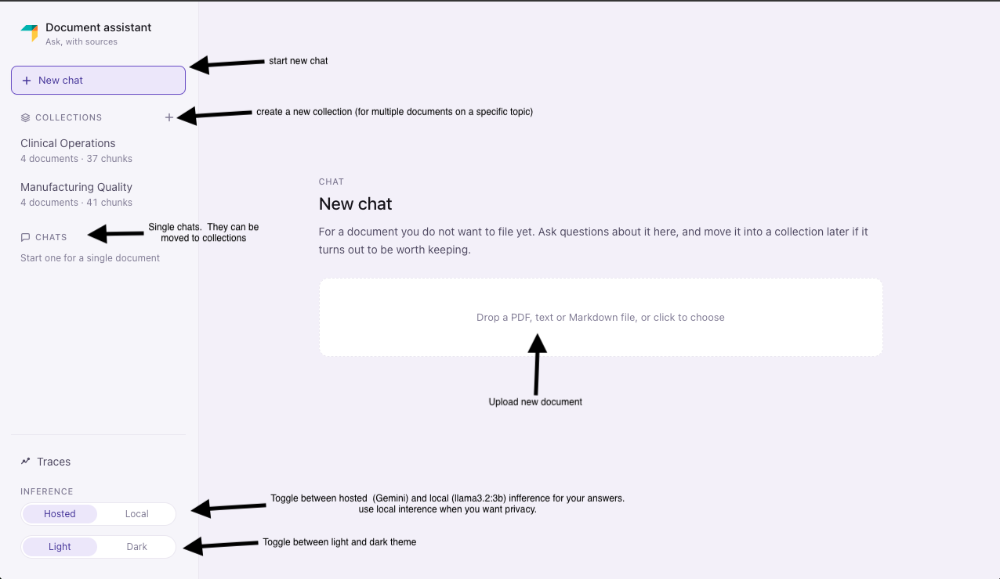

### 2. Create New Collection
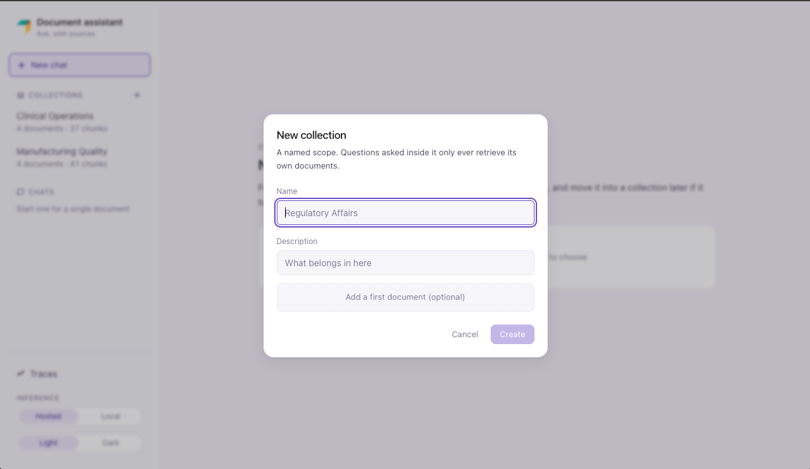

### 3. Document Embedding
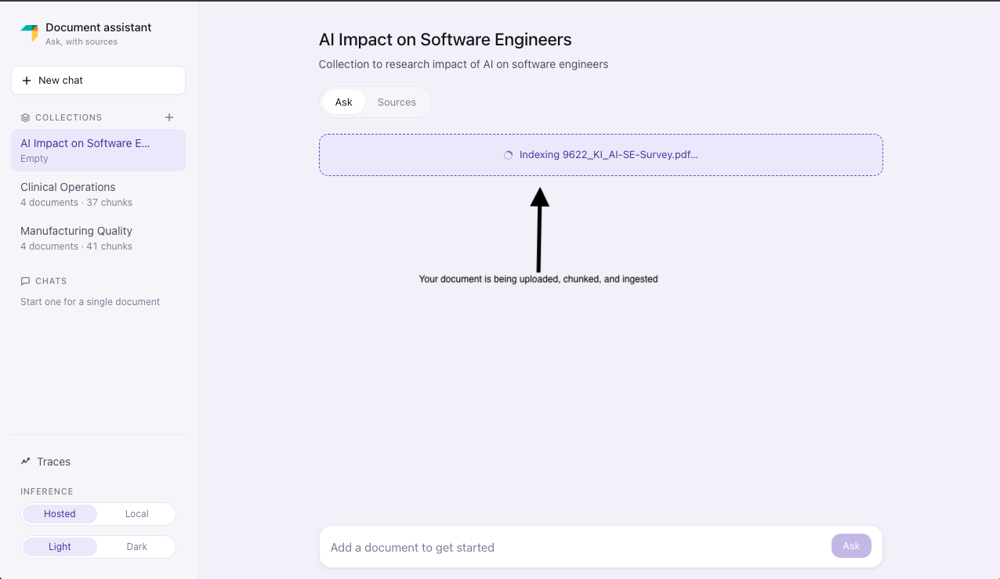

### 4. Embedding Completed
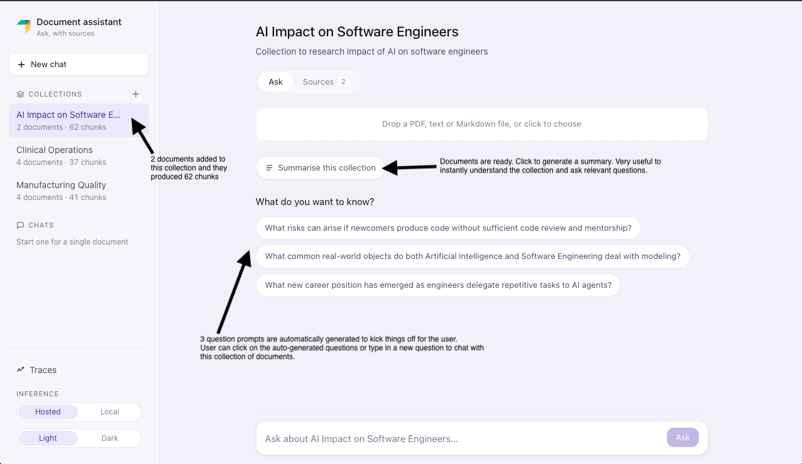

### 5. Summary Generation
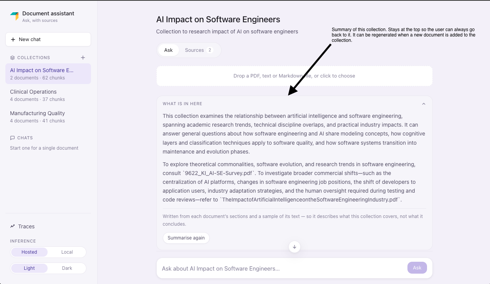

### 6. Chat with Doc (and see sources)
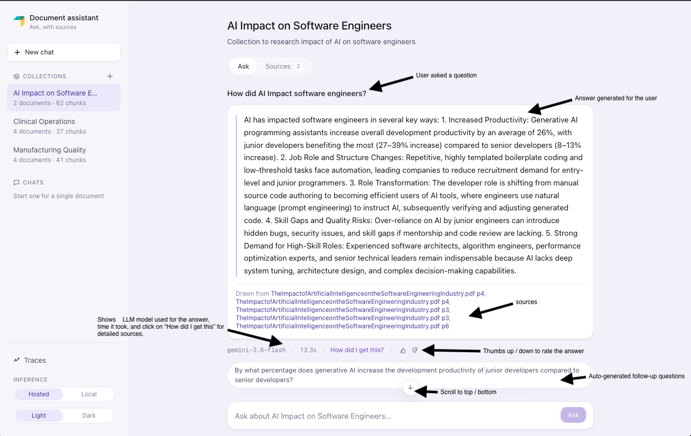

### 7. Answer Sources
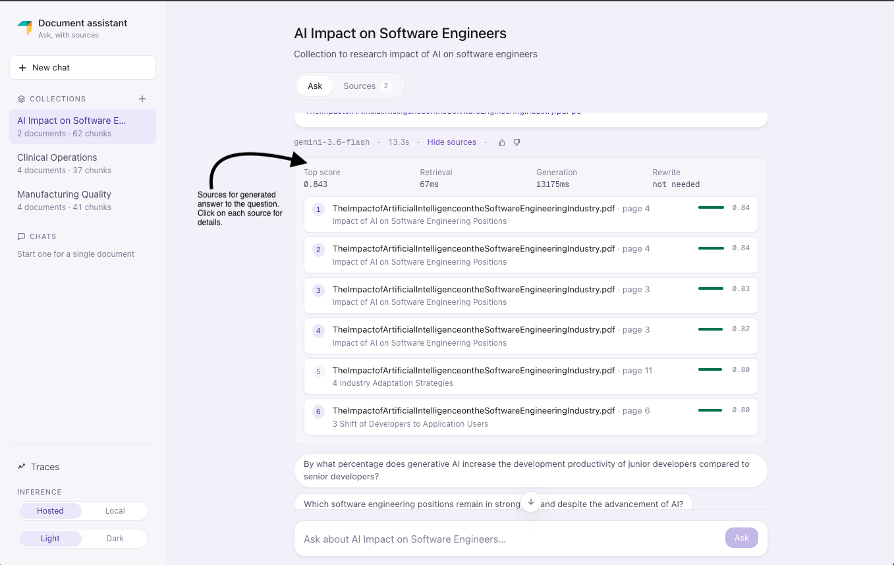

### 8. Answer Sources Expanded
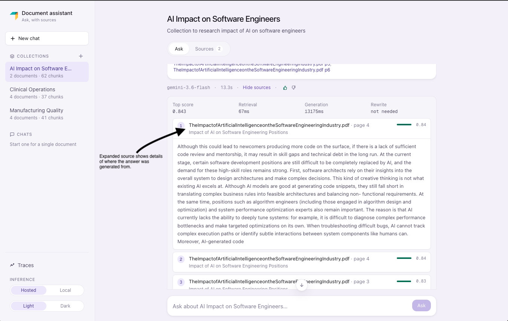

### 9. Collection Documents (Sources)
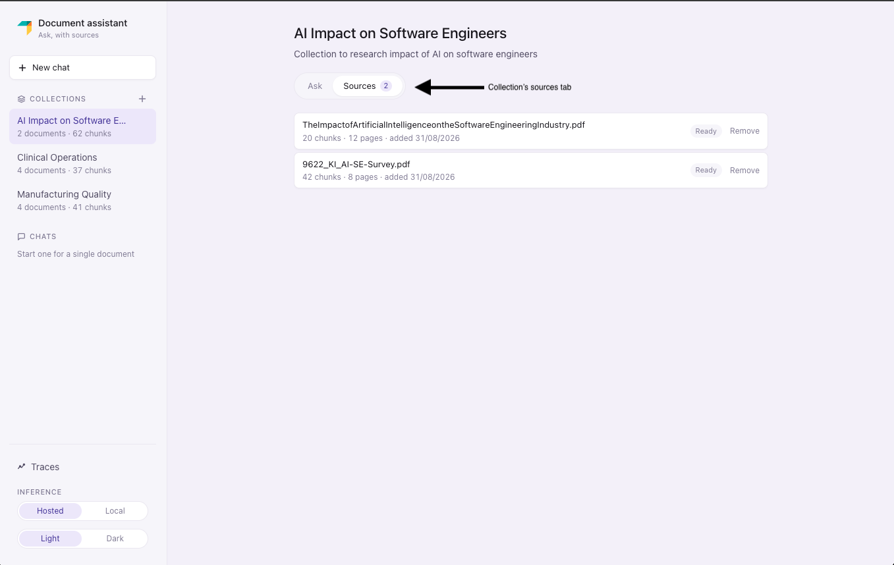

### 10. Observability Homepage
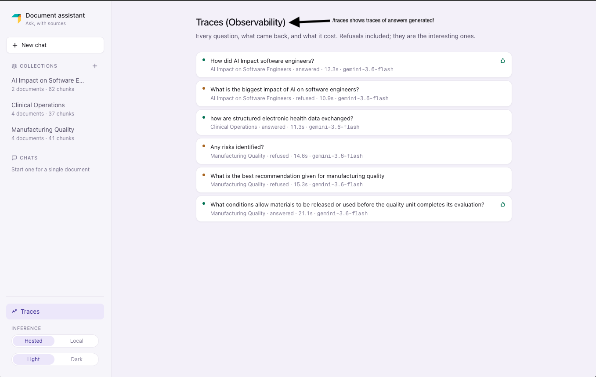

### 11. Observability Detail Page
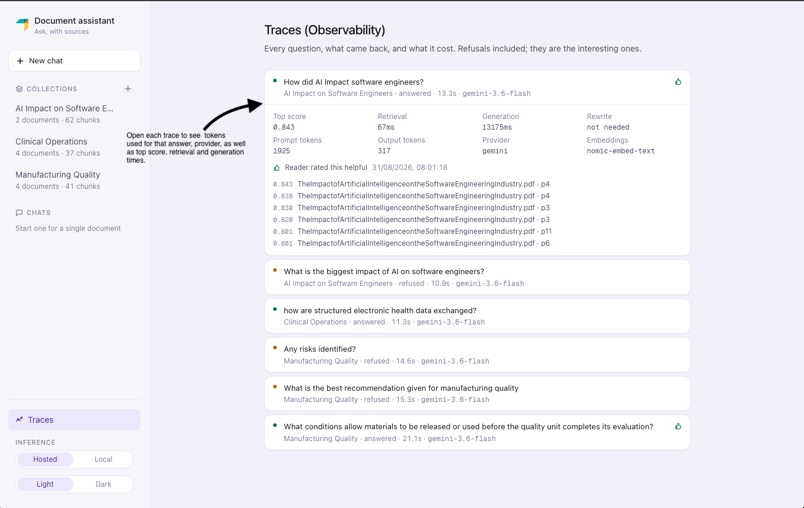

### 12. Dark theme
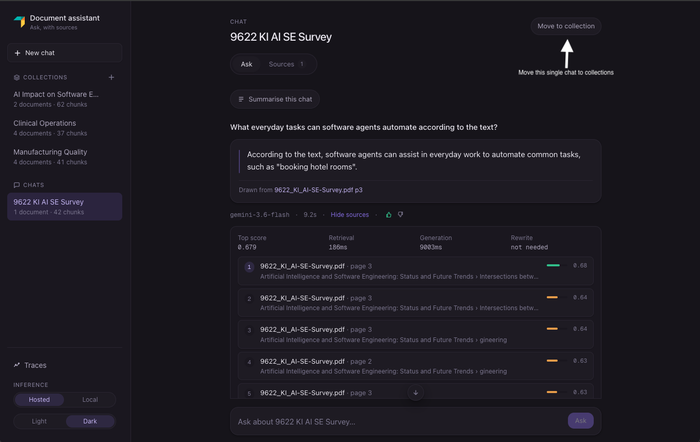